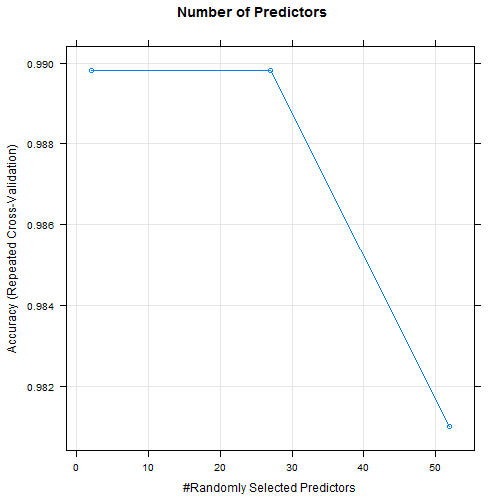

Activity Devices Predictive Model
========================================================
In this article, we studied exercise monitoring devices and built predictive models based on the data collected from these devices. We used Random Forest as the model and used repeated 10-fold cross validation for testing. The estimated out of sample error rate is about 0.92%. Finally we made the prediction for the new dataset with unkonwn activity types.


```r
setwd("C://Users//PengyiSun//Documents//Coursera")
pml<-read.csv("pml-training.csv")
```

## Data Cleaning
We need to get rid of the missing data. Observe the whole dataset, the missing data eigher is blank of NA. We also need to delete all rows with new_wondow=yes. We will also get rid of the users' information.

```r
pmlclean<-pml[pml$new_window!="yes",!(pml[1,]=="" | is.na(pml[1,]))]
pmlclean<-pmlclean[,-c(1:7)]
```

## Model
First, we create data parition. We use 60% of the data for training and the rest for testing.

```r
library(caret)
set.seed(233)
inTrain<-createDataPartition(y=pmlclean$classe, p=0.6, list=FALSE)
train<-pmlclean[inTrain,]
test<-pmlclean[-inTrain,]
```

Next, we use Random Forest to build the model and use 10-fold cross validation for testing.

```r
set.seed(233)
ctrl<-trainControl(method="repeatedcv",repeats=2)
rf<-train(classe~.,data=train,method="rf", trControl=ctrl)
```

Number of predictors selected:

```r
plot(rf,main="Number of Predictors")
```

 

## Out of Sample Error

We estimate the out of bag error by predicting the result on the test dataset:


```r
rfPred<-predict(rf,newdata=test)
confusionMatrix(rfPred,test$classe)
```

```
## Confusion Matrix and Statistics
## 
##           Reference
## Prediction    A    B    C    D    E
##          A 2182    5    0    0    0
##          B    6 1473   17    0    0
##          C    0    9 1320   26    0
##          D    0    0    3 1232    5
##          E    0    0    0    0 1406
## 
## Overall Statistics
##                                         
##                Accuracy : 0.991         
##                  95% CI : (0.988, 0.993)
##     No Information Rate : 0.285         
##     P-Value [Acc > NIR] : <2e-16        
##                                         
##                   Kappa : 0.988         
##  Mcnemar's Test P-Value : NA            
## 
## Statistics by Class:
## 
##                      Class: A Class: B Class: C Class: D Class: E
## Sensitivity             0.997    0.991    0.985    0.979    0.996
## Specificity             0.999    0.996    0.994    0.999    1.000
## Pos Pred Value          0.998    0.985    0.974    0.994    1.000
## Neg Pred Value          0.999    0.998    0.997    0.996    0.999
## Prevalence              0.285    0.194    0.174    0.164    0.184
## Detection Rate          0.284    0.192    0.172    0.160    0.183
## Detection Prevalence    0.285    0.195    0.176    0.161    0.183
## Balanced Accuracy       0.998    0.993    0.990    0.989    0.998
```

The out of sample error is 71/7684=0.92%. 

## Prediction

Now we make predictions on the test dataset:


```r
newTest<-read.csv("pml-testing.csv")
testclean<-newTest[newTest$new_window!="yes",!(newTest[1,]=="" | is.na(newTest[1,]))]
testclean<-testclean[,-c(1:7,60)]
testclean$classe<-"A"
newPred<-predict(rf,newdata=testclean)
```

So the prediction for the new dataset is B, A, C, A, A, E, D, B, A, A, B, C, B, A, E, E, A, B, B, B.
